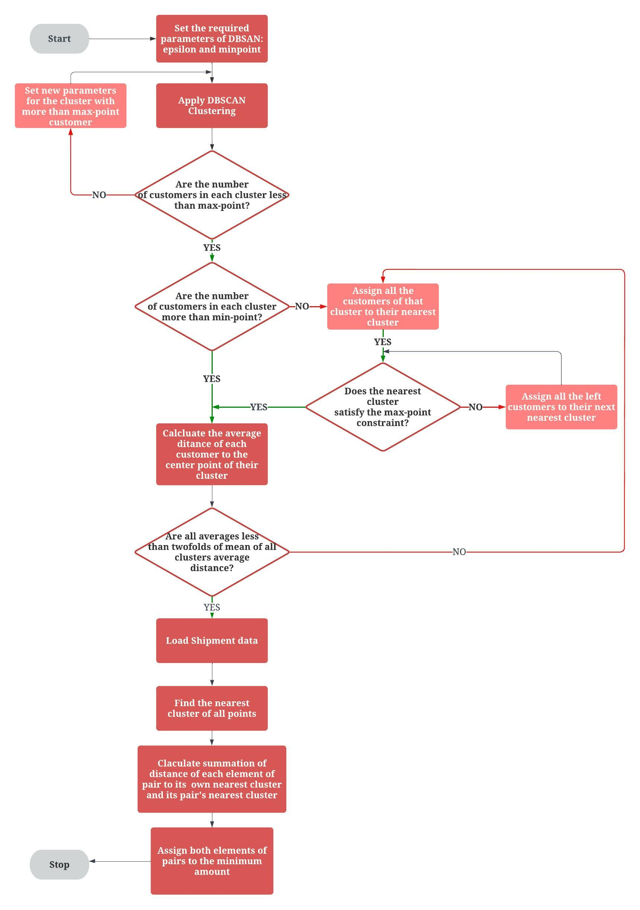

# Recursive_DBSCAN_PDVRP

This repository contains a recursive implementation of DBSCAN clustering applied to the Pickup and Delivery Vehicle Routing Problem (PD-VRP). The approach enables efficient grouping of pickup and delivery locations to support optimal route planning and improved computational performance. The  illustrating the process is provided below:

